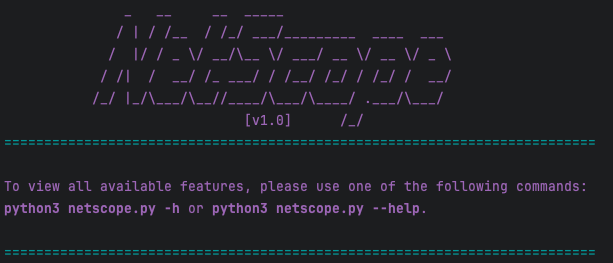
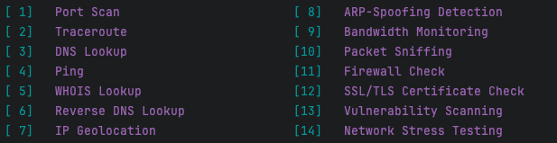

# NETSCOPE - Network Analysis Tool



NETSCOPE is a powerful and versatile network analysis tool designed for performing various network-related tasks, such as port scanning, traceroute, DNS lookups, ping tests, and more. It is built with Python and leverages multiple modules to offer a comprehensive set of features for network diagnostics and security assessments.

## Features


- **Port Scan**: Scan all valid ports (1 to 65535) on a specified target to identify open ports and associated services.
- **Traceroute**: Trace the network route taken by packets to reach the target IP and identify network hops and delays.
- **DNS Lookup**: Perform DNS queries to resolve domain names to IP addresses.
- **Ping**: Check the reachability of a host on the network and measure round-trip time.
- **WHOIS Lookup**: Retrieve domain registration information for a given target.
- **Reverse DNS Lookup**: Find the domain name associated with an IP address.
- **IP Geolocation**: Get the geographical location of an IP address.
- **SSL/TLS Certificate Check**: Validate SSL/TLS certificates for secure connections.
- **Subdomain Scanning**: Scan for common subdomains of a given domain to discover potential hidden services.

## Installation

To install NETSCOPE, simply clone the repository and install the necessary dependencies.

```bash
git clone https://github.com/mvoe/NETSCOPE.git
cd NETSCOPE
pip install -r requirements.txt
```

## Usage

You can use NETSCOPE from the command line with various options. Run the following command to see all available features:

```bash
python3 netscope.py -h
```

### Example Usage:

- To perform a port scan:
  ```bash
  python3 netscope.py -p 192.168.1.1
  ```

- To perform a traceroute:
  ```bash
  python3 netscope.py -t 192.168.1.1
  ```

- To perform an SSL certificate check:
  ```bash
  python3 netscope.py -ssl google.com
  ```

- To scan for subdomains:
  ```bash
  python3 netscope.py -sub example.com
  ```

## Contact

If you have any questions or suggestions, feel free to open an issue or contact me directly on GitHub.

---

© 2024 NETSCOPE
